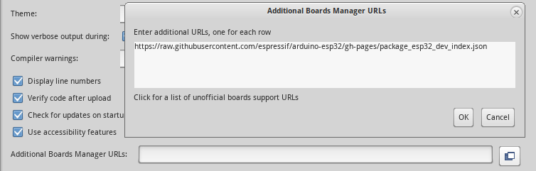
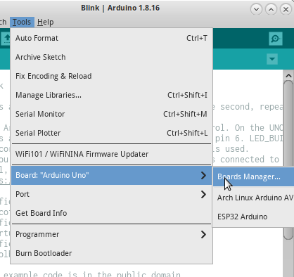
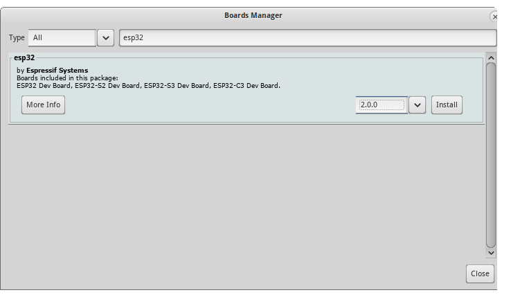
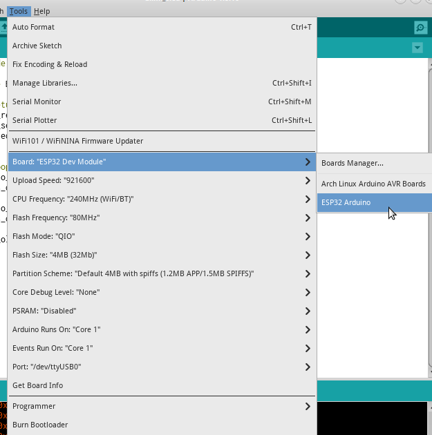

# ESP32 Arduino Programming

## Contents
- [Introduction](#introduction)
- [Installation](#installation)
- [Compilation and Flashing](#compilation-and-flashing)

## Introduction

ESP-IDF also available as an Arduino abstraction variant.
We can use either ESP-IDF API o Arduino to build a binary for ESP32.

## Installation

In this tutorial will explain how install ESP32 framework on **Arduino IDE 1.8.16**.
This tutorial done in **Arch-Linux 5.10-LTS**,
but it should be reproducible in other operating system such as Windows.

This tutorial assumes:
- You already install the Arduino IDE
- You have unlimited stable internet connection

First, install required ESP32 board library.
Open *File*  -> *Preferences*.
Then open Additional Board Manager URLs dialog and add URL below:

```
https://raw.githubusercontent.com/espressif/arduino-esp32/gh-pages/package_esp32_dev_index.json
```



Next, open *Tools* -> *Board* -> *Board Manager*.



On Search Filter, type ESP32, choose **2.0.0** version (as it based on ESP-IDF 4.4), then press *Install* button.



Wait until finished and done.

## Compilation and Flashing

Before continue, make sure you choose correct board for Arduino's target.

Next, open *Tools* -> *Board* -> *ESP32 Arduino* -> *ESP32 Dev Module*.

The board setting should became looks like this:



To compile, click *Sketch* -> *Verify/Compile*

To Upload, click *Sketch* -> *Upload*

**NOTES:** Make sure the **Port** (either **/dev/ttyUSBx** in Linux or **COMx** in Windows) is correct.

 **NOTES:** As some NodeMCU board had problem with RTS/CTS logic, you may need to hold down Flash or IO0 button to enter flashing mode when the **esptool.py** try to reset the board.

**NOTES:**  Arduino will override the board's bootloader and partition table automatically when flashing. No need to do it manually.

**NOTES:** Arduino's bootloader both checking RTS/CTS and IO15 logic state to start the app. You may need to power-on reset the NodeMCU board. No need to worry this workaround if you use custom ESP32 board without RTS/CTS.
