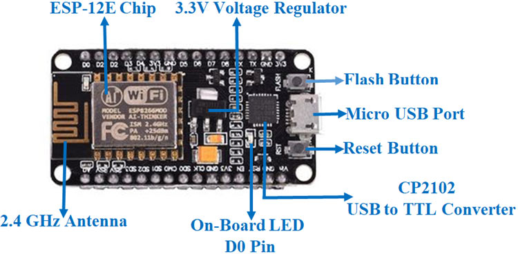
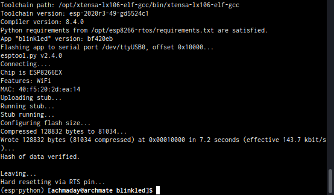
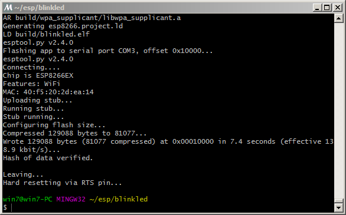

# ESP8266 Flashing

## Content
- [Development Board](https://github.com/mekatronik-achmadi/md_tutorial/blob/master/electronic/tutorials/esp8266_flashing.md#development-board)
- [Changing Mode](https://github.com/mekatronik-achmadi/md_tutorial/blob/master/electronic/tutorials/esp8266_flashing.md#changing-mode)
	+ [Running](https://github.com/mekatronik-achmadi/md_tutorial/blob/master/electronic/tutorials/esp8266_flashing.md#running-mode)
	+ [Bootloader](https://github.com/mekatronik-achmadi/md_tutorial/blob/master/electronic/tutorials/esp8266_flashing.md#bootloader-mode)
- [Flashing](https://github.com/mekatronik-achmadi/md_tutorial/blob/master/electronic/tutorials/esp8266_flashing.md#flashing)
	+ [Arch](https://github.com/mekatronik-achmadi/md_tutorial/blob/master/electronic/tutorials/esp8266_flashing.md#archlinuxmanjaro)
	+ [Windows](https://github.com/mekatronik-achmadi/md_tutorial/blob/master/electronic/tutorials/esp8266_flashing.md#windows)
- [Bootloader](https://github.com/mekatronik-achmadi/md_tutorial/blob/master/electronic/tutorials/esp266_flashing.md#bootloader)

## Development Board

For this tutorial, we use NodeMCU ESP8266 or similar ESP-12x boards.



It's cheap but packed with enough features, good for project starter.


## Changing Mode

ESP32 has two modes:
- Running Mode
- Programming/Bootloader Mode

### Running Mode

By default, ESP32 board boot to Running Mode after power-up or reset.

To reset into Running Mode, press only RST button

### Bootloader Mode

Bootloader Mode is used to flash program.

To reset into Bootloader Mode, press RST button while hold down FLASH button.

## Flashing

Simple command to flashing:

```sh
make app-flash
```



If the process ended successfully, ESP32 will reset into Running Mode automatically

---

### Windows

Before flashing, check the *sdkconfig* file, then change

```
CONFIG_ESPTOOLPY_PORT="/dev/ttyUSB0"
```

to suitable COM port number

```
CONFIG_ESPTOOLPY_PORT="COM1"
```

Then simple command to flashing:

```sh
make app-flash
```



If the process ended successfully, ESP32 will reset into Running Mode automatically

## Bootloader

This is the when case you want to replace or restore bootloader included in ESP-IDF (example: after using Arduino app).

First you may need to erase entire flash memory:

```sh
make erase_flash
```

Next make sure target is appropriate in *sdkconfig* file:

```
CONFIG_IDF_TARGET="esp8266"
```

Then, write ESP-IDF's bootloader (address 0x1000) using command:

```
make bootloader-flash
```

Next, if you use only single app partition table, make sure it in *sdkconfig* file:

```
CONFIG_PARTITION_TABLE_SINGLE_APP=y
```

Then, write partition table (address 0x8000) using command:

```sh
make partition_table-flash
```

Done. Now you can flash app program like previous.
