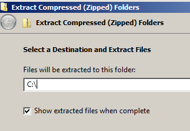
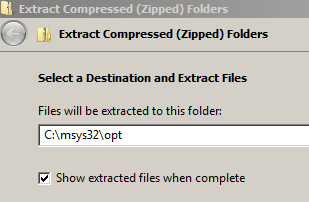
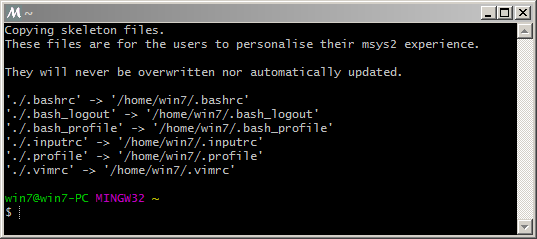
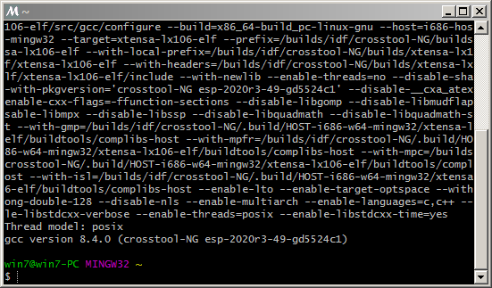
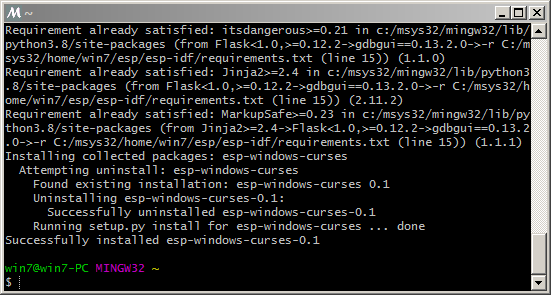
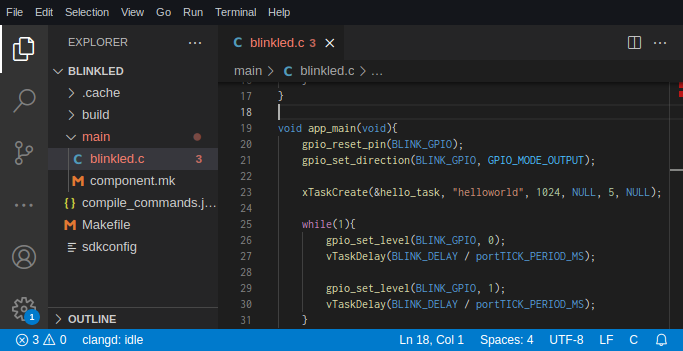
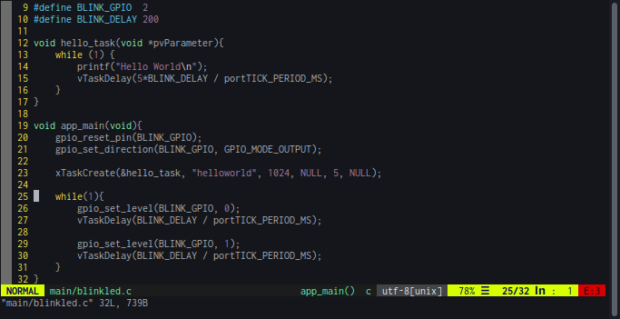
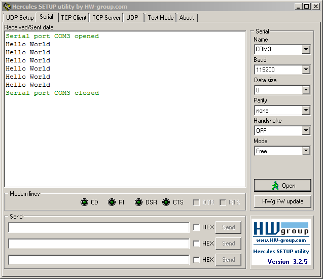
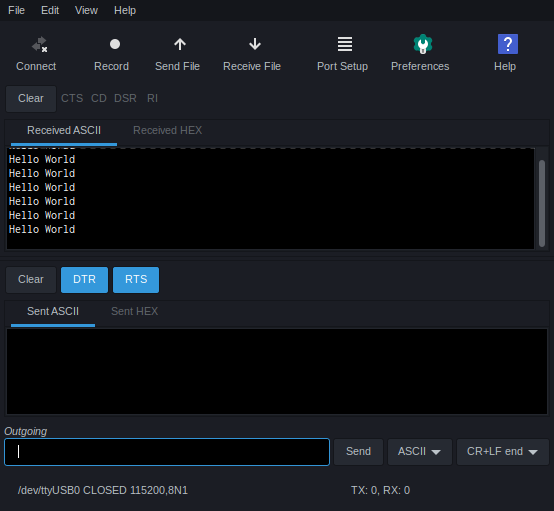

# ESP8266 Programming

## Contents
- [Compiler](https://github.com/mekatronik-achmadi/md_tutorial/blob/master/electronic/tutorials/esp8266_install.md#compiler)
	+ [Arch](https://github.com/mekatronik-achmadi/md_tutorial/blob/master/electronic/tutorials/esp8266_install.md#archlinuxmanjaro)
	+ [Windows](https://github.com/mekatronik-achmadi/md_tutorial/blob/master/electronic/tutorials/esp8266_install.md#windows)
- [USB-TTL Driver](https://github.com/mekatronik-achmadi/md_tutorial/blob/master/electronic/tutorials/esp8266_install.md#usb-ttl-driver)
	+ [Arch](https://github.com/mekatronik-achmadi/md_tutorial/blob/master/electronic/tutorials/esp8266_install.md#archlinuxmanjaro-1)
	+ [Windows](https://github.com/mekatronik-achmadi/md_tutorial/blob/master/electronic/tutorials/esp8266_install.md#windows-1)
- - [Libraries](https://github.com/mekatronik-achmadi/md_tutorial/blob/master/electronic/tutorials/esp8266_install.md#libraries)
	+ [ESP-IDF](https://github.com/mekatronik-achmadi/md_tutorial/blob/master/electronic/tutorials/esp8266_install.md#esp-idf)
		* [Arch](https://github.com/mekatronik-achmadi/md_tutorial/blob/master/electronic/tutorials/esp8266_install.md#archlinuxmanjaro-2)
		* [Windows](https://github.com/mekatronik-achmadi/md_tutorial/blob/master/electronic/tutorials/esp8266_install.md#windows-2)
	+ [Python](https://github.com/mekatronik-achmadi/md_tutorial/blob/master/electronic/tutorials/esp8266_install.md#python)
		* [Arch](https://github.com/mekatronik-achmadi/md_tutorial/blob/master/electronic/tutorials/esp8266_install.md#archlinuxmanjaro-3)
		* [Windows](https://github.com/mekatronik-achmadi/md_tutorial/blob/master/electronic/tutorials/esp8266_install.md#windows-3)
- [Uploader](https://github.com/mekatronik-achmadi/md_tutorial/blob/master/electronic/tutorials/esp8266_install.md#uploader)
- [Editor](https://github.com/mekatronik-achmadi/md_tutorial/blob/master/electronic/tutorials/esp8266_install.md#editor)
	+ [VSCodium](https://github.com/mekatronik-achmadi/md_tutorial/blob/master/electronic/tutorials/esp8266_install.md#vscodium)
		* [Arch](https://github.com/mekatronik-achmadi/md_tutorial/blob/master/electronic/tutorials/esp8266_install.md#archlinuxmanjaro-4)
		* [Windows](https://github.com/mekatronik-achmadi/md_tutorial/blob/master/electronic/tutorials/esp8266_install.md#windows-4)
	+ [Vim](https://github.com/mekatronik-achmadi/md_tutorial/blob/master/electronic/tutorials/esp8266_install.md#vim)
- [Serial Terminal](https://github.com/mekatronik-achmadi/md_tutorial/blob/master/electronic/tutorials/esp8266_install.md#serial-terminal)
	+ [Hercules](https://github.com/mekatronik-achmadi/md_tutorial/blob/master/electronic/tutorials/esp8266_install.md#hercules-terminal-windows)
	+ [MoSerial](https://github.com/mekatronik-achmadi/md_tutorial/blob/master/electronic/tutorials/esp8266_install.md#moserial-gnulinux)

## Compiler

For ESP8266 compiler we can use XTensa-LX106-Elf-GCC.

### ArchLinux/Manjaro

You can use this [AUR Package](https://aur.archlinux.org/packages/xtensa-lx106-elf-gcc-bin/).

**Notes:** You need to replace all **python2-** with **python-** at same module dependencies in PKGBUILD.

---

### Windows

Download this MSYS2 components package [here](https://dl.espressif.com/dl/esp32_win32_msys2_environment_and_esp2020r2_toolchain-20200601.zip)

**Notes:** This package also will install ESP32 compiler.

Unzip the zip file to *C:*  and it will create an msys32 directory with a pre-prepared environment.



The result should a folder named *C:\msys32*

**Notes:** Avoid any spaces in folders and files name from here and on!!!

Next, download the spesific ESP8266 compiler in this [package](https://dl.espressif.com/dl/xtensa-lx106-elf-gcc8_4_0-esp-2020r3-win32.zip)



Unzip this package into *C:\msys32\opt*:

Then run program *C:\msys32\mingw32.exe*



**Notes**: All shell activity will be done in this terminal window.

Then add ESP8266 compiler path to binary path using command

```sh
echo 'export PATH="/opt/xtensa-lx106-elf/bin:$PATH"' | tee -a ~/.bashrc
```

re-run the program *C:\msys32\mingw32.exe*, then check compiler version using command:

```sh
xtensa-lx106-elf.gcc -v
```



## USB-TTL Driver

Depends on kind of development boards used as starting development,
you may need some USB-TTL driver like CH34x, PL230x, CP210x, or FT232x.

### ArchLinux/Manjaro

No need any extra installation since recent kernel already included all of those drivers by default.

### Windows

You can download those drivers here:
- CP210x (try this): [Download](https://drive.google.com/file/d/1EOIDu4Z4NJiLk6UU6dLL4edRn--rqkNG/view?usp=sharing)
- CH34x: [Download](https://drive.google.com/file/d/1-Q9LCqPtK7MlNTnRsnao-CeUexVp9CP1/view?usp=sharing)
- PL230x: [Download](https://drive.google.com/file/d/1TPoFGtD0ngCYNH1h21dQrXWijMSp_XpZ/view?usp=sharing)
- FT232x: [Download](https://www.usb-drivers.org/wp-content/uploads/2014/12/CDM-2.08.28-WHQL-Certified1.zip)

## Libraries

### ESP-IDF

#### ArchLinux/Manjaro

Best library to use is Espressif's ESP-RTOS that compatible API with ESP-IDF.
It included all essential IoT protocol implementations with multithreading provided by FreeRTOS.

You can use this [PKGBUILD](https://github.com/mekatronik-achmadi/archmate/blob/master/packages/pkgbuild/optional/esp8266-rtos/PKGBUILD)

---

#### Windows

First, run program *C:\msys32\mingw32.exe* again

Create a folder *esp/* and change directory into it:

```sh
mkdir -p ~/esp/;cd ~/esp/
```

Then clone ESP-RTOS library and check out to version 3.4:

```sh
git clone https://github.com/espressif/ESP8266_RTOS_SDK.git
cd ESP8266_RTOS_SDK/
git checkout release/v3.4
```

Then update it's submodules:

```sh
git submodule update --init
```

Wait for a while until finished.

---

### Python

In the binary compiling process, ESP-IDF/RTOS utilize some Python modules to parse and linking.

#### ArchLinux/Manjaro

GNU/Linux generally already had good installation of Python environment.
However, we need additional Python modules for ESP-IDF enviroment works well.

First, install Python 3.9 from this [AUR](https://aur.archlinux.org/packages/python39).

Then follow these commands to install in a virtual enviroment:

```sh
cd $HOME
virtualenv --python=/usr/bin/python3.9 esp8266 --system-site-packages

source $HOME/esp8266/bin/activate
pip install kconfiglib future cryptography pyserial pyparsing==2.2.0
deactivate
```

---

#### Windows

For Windows, you dont need Python virtual environments since Python in Windows are already has it's own environments.

**Notes:** Python drop support for old (before SP1) Windows-7 build.
Before continuing, if you use old build of Windows-7, update KB3063858 need to install:
- For [64bit](https://www.microsoft.com/en-us/download/details.aspx?id=47442)
- For [32bit](https://www.microsoft.com/en-us/download/details.aspx?id=47409)

Install that update package and restart the Windows.

Next, set IDF path to environment using command:

```sh
export IDF_PATH=$HOME/esp/ESP8266_RTOS_SDK
```

Then, all you have to do is install required all Python modules:

```sh
python3 -m pip install --user -r $IDF_PATH/requirements.txt
```



## Uploader

For uploader program, we can use ESPTool installed as part of ESP-RTOS.

You can check the version using command:

```sh
python3 $IDF_PATH/components/esptool_py/esptool/esptool.py version
```

## Editor

Technically you can use any text editor to write code, as long as it has:
- Recognize Unix line ending or even using it by default.
- Syntax Highlighting. Write code without highlighting only for psycho.
- Code Completion. It usefull if you dont want to memorize all keywords

Here some of my recommendations:

### VSCodium

VSCodium is a community-driven version of Visual Studio Code (VSCode).
It's build from same source but with all Microsoft touch disabled.

It's a complete source editor.
Has good syntax highlighting.
The downside is since written in electron, it would probably take a lot of memory.
Especially in Windows with a lot extension.



#### ArchLinux/Manjaro
Install VSCodium binary from this [AUR](https://aur.archlinux.org/packages/vscodium-bin/).

#### Windows

You can download for Windows 64-bit [here](https://github.com/VSCodium/vscodium/releases/download/1.53.2/VSCodiumSetup-x64-1.53.2.exe).

---

### Vim

Lets face it, this text editor is powerful, but not for beginner.
I mention it here only because it is an awesome editor.

If you interested, see it yourself [here](https://github.com/mekatronik-achmadi/md_tutorial/blob/master/electronic/tutorials/vim.md)



## Serial Terminal

### Hercules Terminal (Windows)

You can get [here](https://www.hw-group.com/files/download/sw/version/hercules_3-2-8.exe).
It's a portable standalone program, no need to install it.



### MoSerial (GNU/Linux)

A Serial Terminal using GTK+ Toolkit.

To install in ArchLinux/Manjaro:

```sh
sudo pacman -S moserial
```


