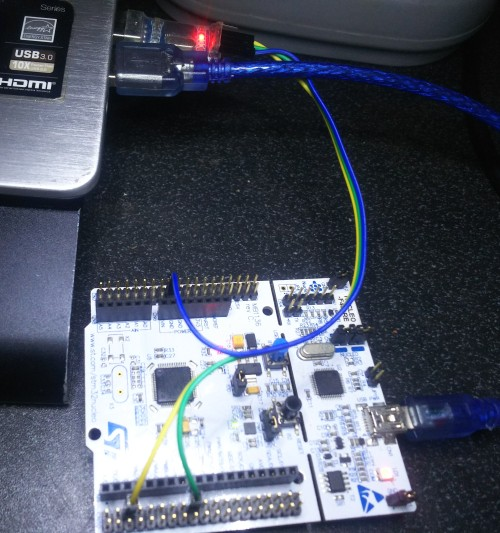

## STM32 Example



An example STM32 programming using ChibiOS/RT for LED Blink and UART Shell.

The development board is NUCLEO-F401RE using UART1.
The USB-TTL is PL2303 but you can use any other USB-TTL UART converter.

## Structures

File Structures:

```
stm32
+-- README.md             # This file
+-- Makefile              # Make build file
+-- STM32example_doxyconf # For build Doxygen
+-- main.c                # Main source code
+-- console.c             # Console command code
+-- console.h             # Console command header
+-- chconf.h              # RTOS config
+-- halconf.h             # Driver config
+-- mcuconf.h             # Chip config
```

## How To Test

Read instructions [here](https://github.com/mekatronik-achmadi/md_tutorial/blob/master/internship/tutorials/stm32.md)

After flashing program, connect USB-TTL then run your favorite serial terminal (38400,8N1) and type:

```sh
help
```

It will show registered command.

or try:

```sh
info
```

It will shows version information.
