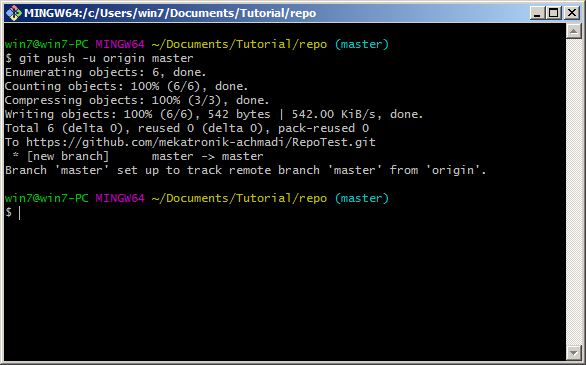
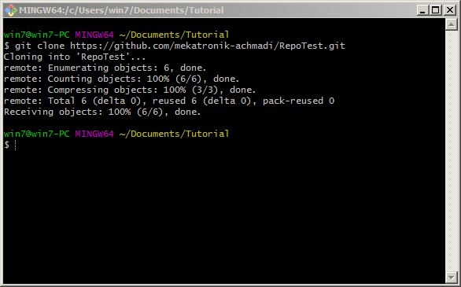
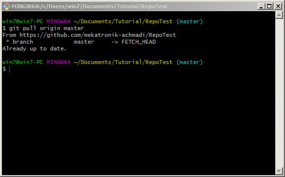
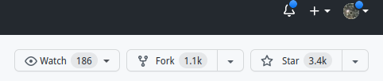
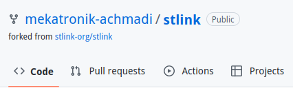

# Github

## Table of Contents
- [Introduction](https://github.com/mekatronik-achmadi/md_tutorial/blob/master/electronic/tutorials/github.md#introduction)
- [New Account](https://github.com/mekatronik-achmadi/md_tutorial/blob/master/electronic/tutorials/github.md#open-new-account)
- [Personal Access Token](https://github.com/mekatronik-achmadi/md_tutorial/blob/master/electronic/tutorials/github.md#creating-personal-access-token)
- [New Repository](https://github.com/mekatronik-achmadi/md_tutorial/blob/master/electronic/tutorials/github.md#create-new-repository)
- [Add Git Local](https://github.com/mekatronik-achmadi/md_tutorial/blob/master/electronic/tutorials/github.md#add-github-repository-to-local-git)
- [Push Commit](https://github.com/mekatronik-achmadi/md_tutorial/blob/master/electronic/tutorials/github.md#push-commit)
- [Git Clone](https://github.com/mekatronik-achmadi/md_tutorial/blob/master/electronic/tutorials/github.md#git-clone)
- [Git Pull](https://github.com/mekatronik-achmadi/md_tutorial/blob/master/electronic/tutorials/github.md#git-pull)
- [Git Fork](https://github.com/mekatronik-achmadi/md_tutorial/blob/master/electronic/tutorials/github.md#git-fork)

## Introduction

Github is an internet service that host Git repository.
It's like Instagram, but instead stores stupid photos/videos,
Github stores Git repositories and connect programmer/developers around the world.

## Open New Account

If you can Sign-Up on Facebook/Instagram, then you should able to signing up on Github.
Just choose free personal account and you can skip advance feature setup like Two-Ways Authentication or SSH Public Key.

But if you still need some guides, you can look [here](https://git-scm.com/book/en/v2/GitHub-Account-Setup-and-Configuration) and [here](https://www.wikihow.com/Create-an-Account-on-GitHub)

## Creating Personal Access Token

As per August 2021, Github no longer accept passwords as authentication for all desktop Git client.
Instead of password, personal access token is used.

Read tutorial on how create Personal Access Token for your Github account [here](https://github.com/mekatronik-achmadi/md_tutorial/blob/master/electronic/tutorials/github_token.md)

**NOTE:** As Personal Access Token used as password in place replacement, you must treat these tokens like passwords.

## Create New Repository

Now assume you already sign-up your new Github account and it's Personal Access Token, next topic is create new Github repository.
This tutorial taken from this Github official [page](https://docs.github.com/en/github/getting-started-with-github/create-a-repo).

First, in the upper-right corner of any page, use the drop-down menu, and select New repository.


Type a short, memorable name for your repository.


Add a description of your repository


Choose a repository visibility. Public Repository is most preferable


Last, click Create repository.


## Add Github Repository to Local Git

Now, add previously created Github repository to previously Git local.

First, open Git Bash on previously Git folder and issue command like this:

```
git remote add origin https://github.com/mekatronik-achmadi/RepoTest.git
```

then push it to Github using command:

```
git push -u origin master
```

You will need to input your Github username (not email) and ~password~ token into terminal or a pop-up dialog box when asked.



## Push Commit

Next working cycle on Git and Github next will essentially like this:
- Make modification or add new untracked files
- Check modified or new file:

```
git status
```

If necessary, review code patch:

```
git diff file
```

- Stage modified or new file:

```
git add file1 file2 file3
```

or

```
git add *
```

- Commit staged files:

```
git commit -m "a descriptive message"
```

- Push it to Github (username and ~password~ token maybe asked here)

```
git push -o origin master
```

## Git Clone

This part tutorial is reversed than previosly tutorials.
We started with an existed Github repository, but no local Git resository.

First, clone the existed Github repository.
Make sure there is no folder with same name with repository name that about to clone.
Then type command like this:

```
git clone https://github.com/mekatronik-achmadi/RepoTest.git
```



Then you can change directory into cloned repository and work cycle stage-commit-push as previosly.

## Git Pull

After you clone a Github repository then that repository getting update,
you don't have to delete cloned directory and re-cloned.

All you have to do is doing pull to get update patch from Github
and merge it with existing local cloned repository.

This also work if you working collaboratively when the Github repository updated by other contributor
and you want to get their update.

To pull from github, use command like this:

```
git pull origin master
```



## Git Fork

A Fork basically a copy of a repository in your own Github account.

To fork a repository, click the Fork button



After forking done, you will have your own copy of that repository in your own Github account,
with the repository's name indicate its a forked repository from someone else


