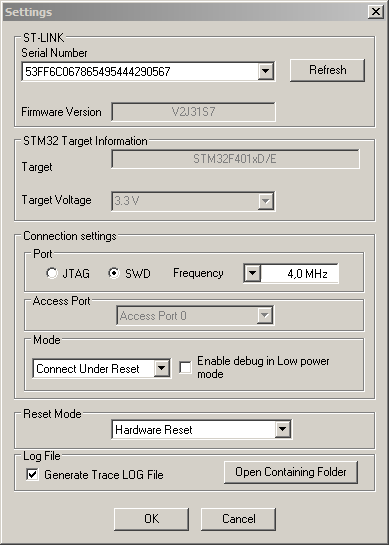

# Flashing

## Table of Contents
- [SWD](https://github.com/mekatronik-achmadi/md_tutorial/blob/master/electronic/tutorials/stm32_flashing.md#swd)
	- [Requirement](https://github.com/mekatronik-achmadi/md_tutorial/blob/master/electronic/tutorials/stm32_flashing.md#requirements)
	- [Pinout](https://github.com/mekatronik-achmadi/md_tutorial/blob/master/electronic/tutorials/stm32_flashing.md#pinout)
	- [Connect](https://github.com/mekatronik-achmadi/md_tutorial/blob/master/electronic/tutorials/stm32_flashing.md#connect)
		- [Windows](https://github.com/mekatronik-achmadi/md_tutorial/blob/master/electronic/tutorials/stm32_flashing.md#windows)
		- [GNU/Linux](https://github.com/mekatronik-achmadi/md_tutorial/blob/master/electronic/tutorials/stm32_flashing.md#gnulinux)
	- [Erasing](https://github.com/mekatronik-achmadi/md_tutorial/blob/master/electronic/tutorials/stm32_flashing.md#erasing)
		- [Windows](https://github.com/mekatronik-achmadi/md_tutorial/blob/master/electronic/tutorials/stm32_flashing.md#windows-1)
		- [GNU/Linux](https://github.com/mekatronik-achmadi/md_tutorial/blob/master/electronic/tutorials/stm32_flashing.md#gnulinux-1)
	- [Writing](https://github.com/mekatronik-achmadi/md_tutorial/blob/master/electronic/tutorials/stm32_flashing.md#writing)
		- [Windows](https://github.com/mekatronik-achmadi/md_tutorial/blob/master/electronic/tutorials/stm32_flashing.md#windows-2)
		- [GNU/Linux](https://github.com/mekatronik-achmadi/md_tutorial/blob/master/electronic/tutorials/stm32_flashing.md#gnulinux-2)
- [Bootloader](https://github.com/mekatronik-achmadi/md_tutorial/blob/master/electronic/tutorials/stm32_flashing.md#bootloader)
	- [Requirement](https://github.com/mekatronik-achmadi/md_tutorial/blob/master/electronic/tutorials/stm32_flashing.md#requirements-1)
	- [Pinout](https://github.com/mekatronik-achmadi/md_tutorial/blob/master/electronic/tutorials/stm32_flashing.md#pinout-1)
	- [Chip Mode](https://github.com/mekatronik-achmadi/md_tutorial/blob/master/electronic/tutorials/stm32_flashing.md#chip-mode)
	- [Connect](https://github.com/mekatronik-achmadi/md_tutorial/blob/master/electronic/tutorials/stm32_flashing.md#connect-1)
		- [Windows](https://github.com/mekatronik-achmadi/md_tutorial/blob/master/electronic/tutorials/stm32_flashing.md#windows-3)
		- [GNU/Linux](https://github.com/mekatronik-achmadi/md_tutorial/blob/master/electronic/tutorials/stm32_flashing.md#gnulinux-3)
	- [Erasing](https://github.com/mekatronik-achmadi/md_tutorial/blob/master/electronic/tutorials/stm32_flashing.md#erasing-1)
		- [Windows](https://github.com/mekatronik-achmadi/md_tutorial/blob/master/electronic/tutorials/stm32_flashing.md#windows-4)
		- [GNU/Linux](https://github.com/mekatronik-achmadi/md_tutorial/blob/master/electronic/tutorials/stm32_flashing.md#gnulinux-4)
	- [Writing](https://github.com/mekatronik-achmadi/md_tutorial/blob/master/electronic/tutorials/stm32_flashing.md#writing-1)
		- [Windows](https://github.com/mekatronik-achmadi/md_tutorial/blob/master/electronic/tutorials/stm32_flashing.md#windows-5)
		- [GNU/Linux](https://github.com/mekatronik-achmadi/md_tutorial/blob/master/electronic/tutorials/stm32_flashing.md#gnulinux-5)

## SWD

SWD (Serial Wire Debug) is a serial communication protocol used for program and debug STM32 chip.
Compared to JTAG (Joint-Test Action) protocol, SWD is subset of it, providing simpler way.

### Requirements

To perform SWD flashing, you need some of these things:
- ST-Link device
  - For Nucleo/Discovery boards, it's already equipped with a ST-Link.
  - For Custom board, you can buy standalone ST-Link device like [this](https://www.aliexpress.com/item/32502417987.html).
  - There is some fake/clone ST-Link like [this](https://www.aliexpress.com/item/1005002072117117.html). Use this only if you really dont have other options.
- ST-Link driver. See installation guide.
- ST-Link interface. See installation guide.

### Pinout

| ST-Link | STM32 | Notes |
|:-------:|:-----:|:-----:|
| VDD | VDD | STLink not providing 3v3 |
| SWCLK | PA14 | Avoid using for GPIO |
| GND | GND | |
| SWDIO | PA13 | Avoid using for GPIO |

### Connect

**Warning**: As STM32 chip will be put under reset, check all other connected device which potentially behave uncontrolably.
Devices like electric motors or it's drivers should turn it off first before put STM32 under reset.

#### Windows

Open _STM32 ST-Link Utility_, then _Target_ -> _Settings_,

From there, make sure:
- _Port_ is set to _SWD_
- _Mode_ is set to _Connect Under Reset_
- _Reset Mode_ is set to _Hardware Reset_



Click _OK_ and ST-Link Utility will show the Flash Memory map contents.


**Notes**: It is possible to connect STM32 without putting the chip under reset.
But it will not give STLink full control of STM32 chip.

#### GNU/Linux

To test connection, you can test reset STM32 Chip using command:

```
sudo st-flash reset 0x8000000
```


### Erasing

Erasing or especially Mass/Full Erasing is way to make sure STM32 chip will not leave any left-over value in it's flash memory.
With this, you can expect STM32 will work as intended.
Futhermore, if you use STM32 Flash as EEPROM, this will reset value of all it's address.

#### Windows

To erase chip, go to _Target_ -> _Erase Chip_, then click _OK_ on confirmation dialog.

STLink Utility then will show all program memory section (0x8000000 and above) become their default value (0xFFFFFFFF).


#### GNU/Linux

To mass erase, use command:

```
sudo st-flash erase
```


### Writing

#### Windows

First you open compilation result file, either Intel Hex (.hex) or Raw Binary (.bin).
Go to _File_ -> _Open file_, then navigate to intended file.

Now STLink Utility will show memory value map of that file in a tab on the right of Devices Memory map tab.


Now, to start program, go to _Target_ -> _Program & Verify_, then Click _Start_ to write to STM32 chip


After that, make sure you see "Verification...OK" on STLink Utility log.


Now you can disconnect the chip using menu _Target_ -> _Disconnect_

#### GNU/Linux

First, open terminal where .bin file reside.
Then use command:

```
sudo st-flash write ./build/*.bin 0x8000000
```


then reset it using previously command:

```
sudo st-flash erase
```

**Note**: If you get verification failure the this,


then you just need to repeat previously write command once again.

## Bootloader

In every STM32 chip, there is a section of memory where a bootloader embedded in it.
This bootloader can used for program the chip using only standard serial communication, mainly UART and I2C protocol.

This guide will explain how to use bootloader to program via UART.

### Requirements

Using bootloader, you need these things:
- USB/TTL-UART converter. You can use converter based on FT232RL, PL2303, or CH34x chip.
For testing this guide, we use PL2303 like [this](https://www.aliexpress.com/item/32850863681.html) as it cheap.
- STM32 Bootloader program. See installation guide

### Pinout

Most of programming bootloader on STM32 use UART1 as default channel.

| PL2303 | STM32 | Notes |
|:-------:|:-----:|:-----:|
| VDD | VDD | 3v3 |
| TX | PA10 | UART1 RX |
| RX | PA9 | UART1 TX |
| GND | GND | |
| VDD/GND | BOOT0 | |
| GND | PB2 | BOOT1 |

### Chip Mode

Each after reset or re-power, STM32 will boot into different modes based on BOOT0 and BOOT1 state.

| Modes | BOOT0 | BOOT1 |
|:-----:|:-----:|:-----:|
| Running | 0 | 0 |
| Bootloader | 1 | 0 |

The 0 value means 0v or GND and the 1 value means 3v3 or VDD.

So, to change boot modes, just set STM32 BOOT pins according table above and then reset/re-power

In BluePill board, it to boot pinout is like this:


### Connect

**Warning**: As STM32 chip will be put under reset, check all other connected device which potentially behave uncontrolably.
Devices like electric motors or it's drivers should turn it off first before put STM32 under reset.

#### Windows

First, Open Windows _Device Manager_ to check on which number COM Port registered.


Now, open _Demonstrator GUI_ from Windows menu, then make sure the _Port Name_ is match.


Before click _Next_, make sure the STM32 chip **already** booted into bootloader.
Otherwise, it will make this program freeze.

After click _Next_, you will see message that chip is readable


Then just click _Next_ a couple time, until you this main page:


#### GNU/Linux

First, check USB/Serial port using command:

```
ls /dev/ttyUSB*
```

it will be like /dev/ttyUSB0, /dev/ttyUSB1, /dev/ttyUSB2, etc

Now to test connection, you can test getting STM32 Chip using command:

```
sudo stm32flash /dev/ttyUSB0
```


### Erasing

Erasing or especially Mass/Full Erasing is way to make sure STM32 chip will not leave any left-over value in it's flash memory.
With this, you can expect STM32 will work as intended.
Futhermore, if you use STM32 Flash as EEPROM, this will reset value of all it's address.

#### Windows

To perform Mass/Full Erase, choose _Erase_ and _All_,


Then click _Next_ and wait until you see this page.


**Warning**: if your next action is to write program, dont click _Back_.
But Click _Close_ and start the connecting process from start (including resetting STM32 chip).

#### GNU/Linux

To mass erase, use command:

```
sudo stm32flash -o /dev/ttyUSB0
```


### Writing

#### Windows

To perform writing, choose _Download to Devices_

The to open compilation result file, click three dotted button right on file name bar.
On file selection dialog, use either _hex Files_ or _bin Files_ as file format.

For erase option, werecommend _Global Erase_

Lastly, dont forget to check _Verify after download_


Now, you can click _Next_ and chip programming will started.


Make sure verification is success in the end.


Now you can _Close_ and change the chip STM32 to boot into Running mode.

#### GNU/Linux

First, open terminal where .bin file reside.
Then use command:

```
sudo stm32flash -w ./build/*.bin -v /dev/ttyUSB0
```


Make sure writing and verification is success at 100%.
Then you change the chip STM32 to boot into Running mode.
