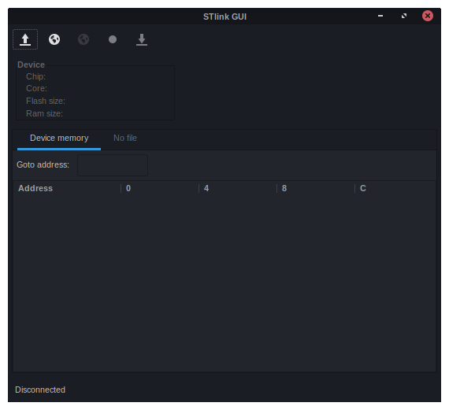
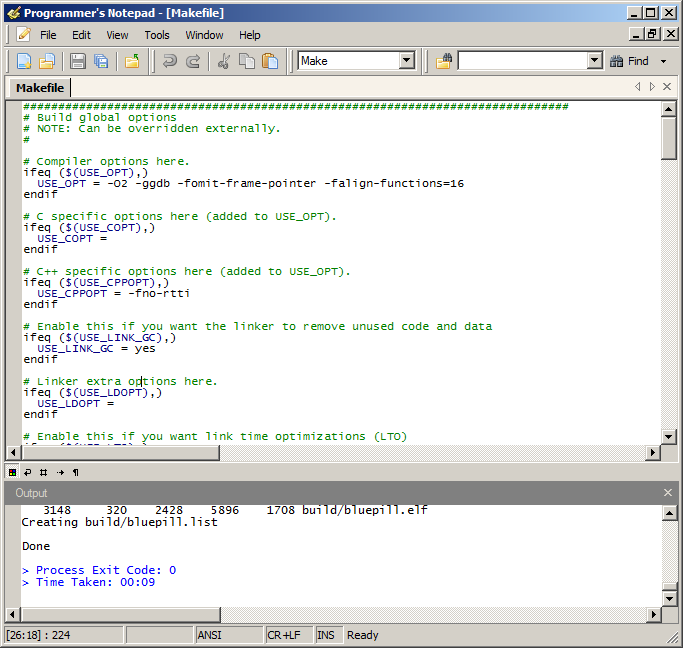

# STM32 Programming

## Table of Contents
- [Compiler](https://github.com/mekatronik-achmadi/md_tutorial/blob/master/electronic/tutorials/stm32_install.md#compiler)
- [Windows Driver](https://github.com/mekatronik-achmadi/md_tutorial/blob/master/electronic/tutorials/stm32_install.md#windows-driver)
- [Uploader](https://github.com/mekatronik-achmadi/md_tutorial/blob/master/electronic/tutorials/stm32_install.md#uploader)
	- [SWD](https://github.com/mekatronik-achmadi/md_tutorial/blob/master/electronic/tutorials/stm32_install.md#swd)
	- [UART-Bootloader](https://github.com/mekatronik-achmadi/md_tutorial/blob/master/electronic/tutorials/stm32_install.md#uart-bootloader)
- [Libraries](https://github.com/mekatronik-achmadi/md_tutorial/blob/master/electronic/tutorials/stm32_install.md#libraries)
- [Editor](https://github.com/mekatronik-achmadi/md_tutorial/blob/master/electronic/tutorials/stm32_install.md#editor)
	- [Programmer Notepad](https://github.com/mekatronik-achmadi/md_tutorial/blob/master/electronic/tutorials/stm32_install.md#programmers-notepad-windows)
	- [VSCodium](https://github.com/mekatronik-achmadi/md_tutorial/blob/master/electronic/tutorials/stm32_install.md#vscodium)
	- [Vim](https://github.com/mekatronik-achmadi/md_tutorial/blob/master/electronic/tutorials/stm32_install.md#vim)
- [Chip Explorer](https://github.com/mekatronik-achmadi/md_tutorial/blob/master/electronic/tutorials/stm32_install.md#chip-explorer)
- [Serial Terminal](https://github.com/mekatronik-achmadi/md_tutorial/blob/master/electronic/tutorials/stm32_install.md#serial-terminal)
	- [Hercules](https://github.com/mekatronik-achmadi/md_tutorial/blob/master/electronic/tutorials/stm32_install.md#hercules-terminal-windows)
	- [MoSerial](https://github.com/mekatronik-achmadi/md_tutorial/blob/master/electronic/tutorials/stm32_install.md#moserial-gnulinux)

## Compiler

For compiler, we use *gcc-arm-none-eabi* as it open-source standard for STM32.

#### For Windows
You can download it [here](https://developer.arm.com/tools-and-software/open-source-software/developer-tools/gnu-toolchain/gnu-rm/downloads).

**Alternatively**, you can download our [package](https://drive.google.com/file/d/1q520gOruQ-TH--J5tU-m1gB9pVVkQB8W/view?usp=sharing).
With this package, all you have to do is extract _gcc-arm-suite_ directory from it to C:\\
and then add it's /bin path (C:\gcc-arm-suite\bin) to Windows's system environment variable.

For Windows-7, right-click _Computer_ on menu -> _Properties_ -> _Advanced System Settings_ -> _Environment Variables_.

On _System Variables_, double-click _Path_, the on variable value add ";C:\gcc-arm-suite\bin" (without quotes and semicolon work as value separator).
Click _OK_ in the end.


#### For ArchLinux/Manjaro

```
sudo pacman -S arm-none-eabi-gcc arm-none-eabi-newlib
```

you can test this installation from CMD using:

~~~
arm-none-eabi-gcc --version
~~~


---

## Windows Driver

By default, ST Driver is not included in Windows Installation.
We not cover driver installation in Windows-8 or above as we currently dont have access to it.

Here a list of download URL:
- STLink. If you use STLink as program uploader, you can install driver from official ST Webpage (need a free registration).

**Alternatively**, you can download our STLinkUtility package [here](https://drive.google.com/file/d/17PP_mZ2qHATJZAJOSbEJMLryBORNO2R2/view?usp=sharing) (it is also from ST but you can download here without registration).

- USB/TTL. This driver should be installed if you plan to use USB/TTL chip as serial communication.
You can search download URL by yourself, but here we provide some (this is tested only on Windows-7):
  - CH34x: [Download](https://drive.google.com/file/d/1-Q9LCqPtK7MlNTnRsnao-CeUexVp9CP1/view?usp=sharing)
  - PL230x: [Download](https://drive.google.com/file/d/1TPoFGtD0ngCYNH1h21dQrXWijMSp_XpZ/view?usp=sharing)
  - FT232x: [Download](https://www.usb-drivers.org/wp-content/uploads/2014/12/CDM-2.08.28-WHQL-Certified1.zip)

- VCP. If you plan to use USB-CDC as Virtual Com Port in STM32, you need to install the ST's VCP driver. You can get our package [here](https://www.usb-drivers.org/wp-content/uploads/2014/12/CDM-2.08.28-WHQL-Certified1.zip).

---

## Uploader

Uploader software are required to flashing STM32 chip with program we build.
There's two popular ways to flashing chip, via SWD and UART Bootloader:

### SWD

Using SWD, you need ST-Link device (preferrably not Chinese clone) connected to STM32's SWDIO, SWCLK, and GND pin.

#### For Windows

Install STSW to use ST-Link, you can download from ST's Official Web or get our package [here](https://drive.google.com/file/d/17PP_mZ2qHATJZAJOSbEJMLryBORNO2R2/view?usp=sharing)

**Note**: To run STLinkUtility, you may need Visual C++ Redistributable 32bit (x86) [here](https://aka.ms/vs/16/release/vc_redist.x86.exe) or 64bit (x64) [here](https://aka.ms/vs/16/release/vc_redist.x64.exe)..


#### For ArchLinux/Manjaro

```
sudo pacman -S stlink
```



### UART Bootloader

Using Bootloader, you need USB/TTL converter connected to STM32's RX, TX, and GND pin.
You need to reset STM32 into Bootloader mode by putting BOOT0 to Low and BOOT1 to High.
Then back to Run mode by putting BOOT1 to Low after flashing done.
Install USB/TTL driver and Flashloader to use this methode.

#### For Windows

You can download Flashloader from web or get our package [here](https://drive.google.com/file/d/16X2A41JwBmAY4dVMn1nfmbGJTxy3zclD/view?usp=sharing).


#### For ArchLinux/Manjaro

Install stm32flash from this [AUR](https://aur.archlinux.org/packages/stm32flash/).

---

## Libraries

In this project, we prefer to use ChibiOS/RT over ST's FWLib.
Some of reason are:
- Has RTOS kernel integrated on it
- API relatively same across STM32 chip family, also even across other ARM Cortex-M like LPC, NXP, etc.
- We already use it since 2015

We use ChibiOS version 3.0.x.
You can download [here](https://osdn.net/projects/chibios/scm/svn/tree/head/branches/stable_3.0.x/).

**Alternatively** you can get our package ChibiOS-STM32 [here](https://drive.google.com/file/d/11ivvhc-s3gQD2uzF0HDYm6e5w_w103FT/view?usp=sharing).
It's basically same thing but all platforms other than STM32 already removed.

---

## Editor

Technically you can use any text editor to write code, as long as it has:
- Recognize Unix line ending or even using it by default.
- Syntax Highlighting. Write code without highlighting only for psycho.
- Code Completion. It usefull if you dont want to memorize all keywords

Here some of our recommendations:

### Programmer's Notepad (Windows).
It's a simple source editor.
Has good syntax highlighting.
Only downside is this editor actually from winAVR project, so it still has winAVR brand on it.

You can get our package [here](https://drive.google.com/file/d/1nmF6X_4iJKNP1QdEUqnjhlbvPfEOGUQz/view?usp=sharing).
Extract it to C:\ (C:\programmer-notepad\) then right-click _programmer-notepad.exe_, choose _Pin to Start Menu_



For GNU/Linux, you can use desktop native source editor, like Pluma (Mate), GEdit (Gnome), Kate (KDE), etc.

### VSCodium

VSCodium is a community-driven version of Visual Studio Code (VSCode).
It's build from same source but with all Microsoft touch disabled.

It's a complete source editor.
Has good syntax highlighting.
The downside is since written in electron, it would probably take a lot of memory.
Especially in Windows with a lot extension.

#### For Windows

You can download for Windows 64-bit [here](https://github.com/VSCodium/vscodium/releases/download/1.53.2/VSCodiumSetup-x64-1.53.2.exe).

#### For ArchLinux/Manjaro

Install VSCodium binary from this [AUR](https://aur.archlinux.org/packages/vscodium-bin/).


### Vim

Lets face it, this text editor is powerful, but not for beginner.
We mention it here only because it is an awesome editor.

If you interested, see it yourself [here](https://github.com/mekatronik-achmadi/md_tutorial/blob/master/electronic/tutorials/vim.md)


---

## Chip Explorer

STMicroelectronic provide a helper tool called STM32CubeMX to be used as chip explorer and code-generator (we don't use this part here).

For chip explorer, we can use this program to explorer in-chip features (GPIOs, Peripherals, Clocks, etc).
The MX stands for Microchip eXplorer.

It's Java program, so it requires a JRE program with version 8 is recommended, but it can run in both GNU/Linux and Windows.

For ArchLinux/Manjaro, there's [AUR Package](https://aur.archlinux.org/packages/stm32cubemx) available.

For general installation, you can download it's installer [here](https://www.st.com/en/development-tools/stm32cubemx.html#overview&secondary=st-get-software) (a free registration required).

Alternatively, if you dont like to register yourself, you can download an older installer [here](https://drive.google.com/file/d/16XVudPN4LTub3fV_zqC9RBCbw3eY6EWL/view?usp=sharing).

Lastly, if you using Windows and dont have a working JRE installed,
you can download offline JRE installer for Windows [here](https://www.java.com/en/download/manual.jsp).


---

## Serial Terminal

If you use some Serial Communication, you may need some Serial Terminal.
You free to choose any Serial Terminal you like, I'm here just giving recommendation:

### Hercules Terminal (Windows)

You can get [here](https://www.hw-group.com/files/download/sw/version/hercules_3-2-8.exe).
It's a portable standalone program, no need to install it.


### MoSerial (GNU/Linux)

This is Serial Terminal like Hercules above, but written in GTK so it can run in GNU/Linux.

For ArchLinux/Manjaro:

```
sudo pacman -S moserial
```


