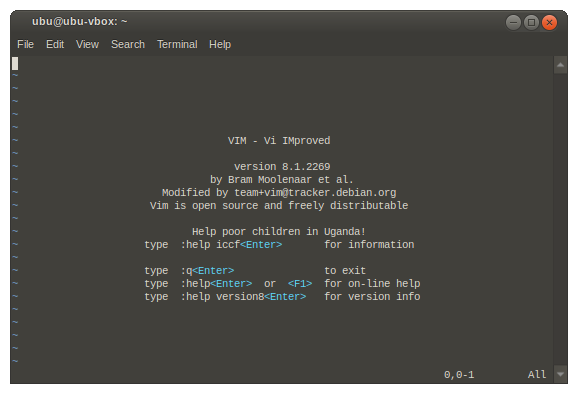
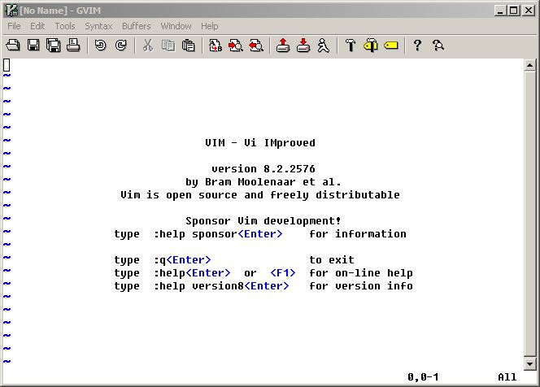
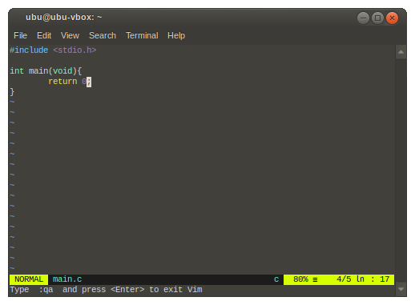
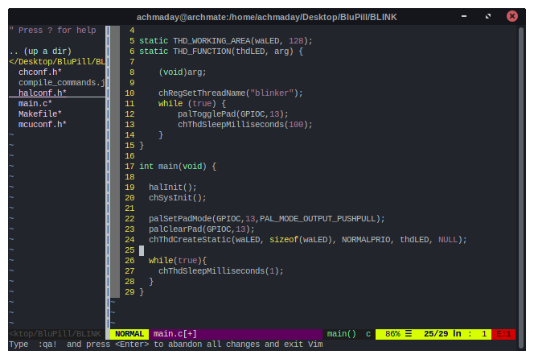
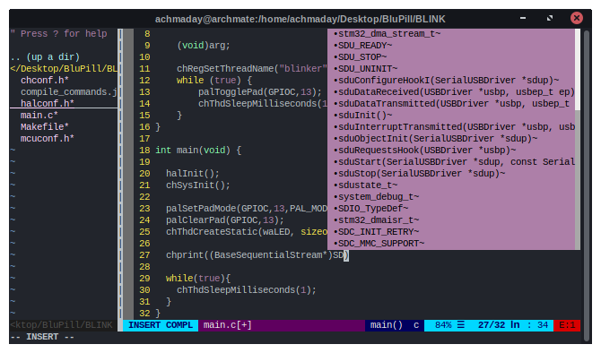

# Vim

## Table of Contents
- [Introduction](https://github.com/mekatronik-achmadi/md_tutorial/blob/master/electronic/tutorials/vim.md#introduction)
- [Installation](https://github.com/mekatronik-achmadi/md_tutorial/blob/master/electronic/tutorials/vim.md#installation)
- [Exit Vim](https://github.com/mekatronik-achmadi/md_tutorial/blob/master/electronic/tutorials/vim.md#exit-vim)
	- [Short Version](https://github.com/mekatronik-achmadi/md_tutorial/blob/master/electronic/tutorials/vim.md#short-version)
	- [Detailed Version](https://github.com/mekatronik-achmadi/md_tutorial/blob/master/electronic/tutorials/vim.md#detailed-version)
- [Vim Enhancement](https://github.com/mekatronik-achmadi/md_tutorial/blob/master/electronic/tutorials/vim.md#vim-enchancement)
- [Vim Coc](https://github.com/mekatronik-achmadi/md_tutorial/blob/master/electronic/tutorials/vim.md#vim-coc)

## Introduction

Vim is a very powerful terminal source editor, but much lightweight compared to modern source editor.

It is an extended version of vi with additional features,including syntax highlighting,
a comprehensive help system, native scripting (vimscript),
a visual mode for text selection, comparison of files (vimdiff),
and tools with restricted capabilities such as rview and rvim.

Let's face it, Vim is not for beginner or non-commitment programmers.
It never was and it will never be.

## Installation

### Debian/Ubuntu

Vim should came pre-installed.
If not, you can install with command:

```
sudo apt-get install vim
```

### ArchLinux/Manjaro

```
sudo pacman -S vim
```

To start vim from terminal, type command:

```
vim
```



### Windows

You can download gvim (Vim with GUI) installer [here](https://github.com/vim/vim-win32-installer/releases/download/v8.2.2576/gvim_8.2.2576_x64.exe)

You can start _gVim_ from start-menu.



## Exit Vim

As this is one of most search topic on the internet, we will mentioned here for easy practice.

### Short version

Press **Esc** or **CTRL+c** twice or more as you like, then type **:q** (colon then q)

### Detailed version

Vim is modal editor, which mean it run on multiple modes in one program.
In bottom-left of program will show currently active mode.

Here's some popular of Vim modes:
- **NORMAL**. This is default mode and activated when Vim started.
To switch into this mode from other modes, press **Esc** or **CTRL+c**.

- **INSERT**. This is editing mode like you would find in other text editor.
To switch into this mode from NORMAL mode, press **i** (stand for insert).

- **VISUAL**. This is text-selecting mode to do copy or delete.
To switch into this mode from NORMAL mode, press **v** (stand for visual).

- **COMMAND**. This is command mode, to run a command from NORMAL mode.
Some example command to input (while in NORMAL mode):
	- **:q** to quit from Vim
	- **:w** to write Vim content to file
	- **:wq** to write then quit
	- **:q!** to force quit and abandone everything
	- **:w main.c** to write Vim content to file main.c

## Vim Enchancement

Vim is extensible editor and there are many plugins available.
Here we will show just some very good plugins to make Vim more enjoyable.

### Debian/Ubuntu

```
sudo apt-get install vim-airline vim-ultisnips
```



### ArchLinux/Manjaro

```
sudo pacman -S vim-nerdtree vim-airline vim-ultisnips
```



### Windows

Until right-now, Vim plugins doesn't work really well in Windows.
So I don't really recommend it.
If you need more than just text editor, you should go with VSCodium instead.

## Vim CoC

Vim CoC (Conquer of Completion) is a project to integrate many language server protocol into Vim.
With this, Vim will be able to analyze code and provide code-completion or snippet, like VSCode.

For now, I only give a list of some AUR packages for ArchLinux/Manjaro.
For Debian/Ubuntu hopefully coming soon.
For Windows, go with VSCodium instead.

Here some tested AUR packages:
- [CoC server](https://aur.archlinux.org/packages/vim-coc-git/)
- [CoC pair](https://aur.archlinux.org/packages/vim-coc-pairs-git/)
- [CoC snippets](https://aur.archlinux.org/packages/vim-coc-snippets-git/)
- [CoC highlight](https://aur.archlinux.org/packages/vim-coc-highlight-git/)
- [CoC clangd](https://aur.archlinux.org/packages/vim-coc-clangd-git/)


